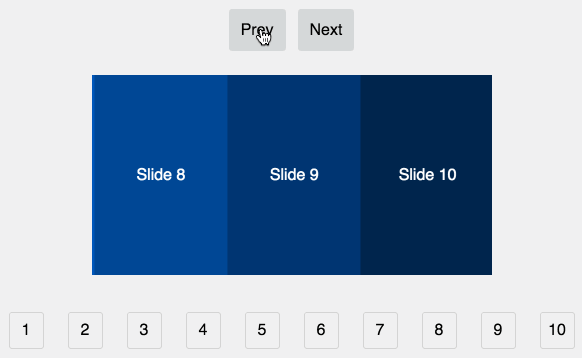

## React Motion Slider 0.0.1

Slider/Carousel powered by React Motion.
Working on more features, and a less opinionated version.

## Example Usage


```
<div>
  <Slider ref="slider">
    {this.state.slides.map((slide, i) => <li key={i} className="slide" />)}
  </Slider>
  <nav className="slider__controls">
    <a className="slider__control slider__control--prev" onClick={this.prev.bind(this)}>Prev</a>
    <a className="slider__control slider__control--next" onClick={this.next.bind(this)}>Next</a>
  </nav>
</div>
```

## TODOS

- [x] touch support
- [ ] handle dragging outside of slider
- [ ] add props to allow flexibility
- [ ] keyboard support
- [ ] ARIA support